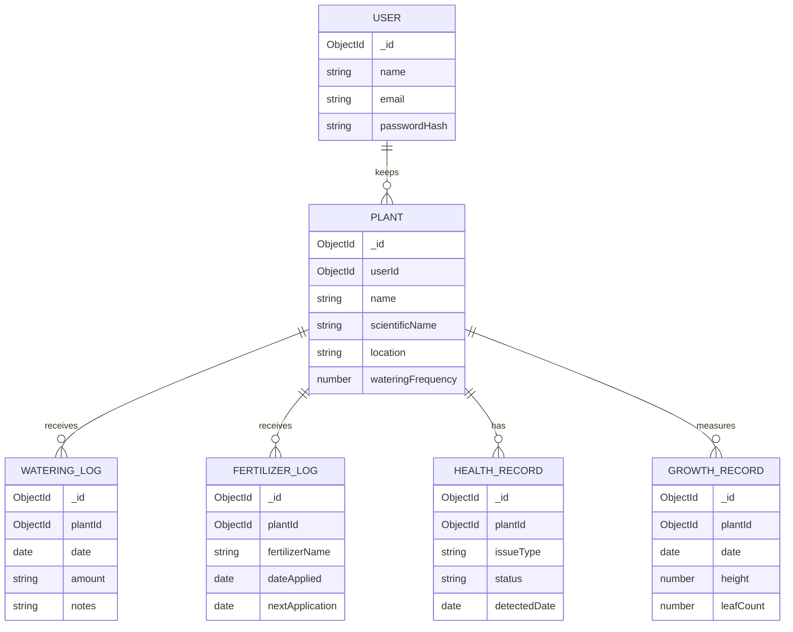

# PlantCare

A botanical journal for Indian home gardens. PlantCare records plant identity, care events, health observations and growth in MongoDB, with a React interface that communicates only through an Express REST API.

## Objective and features

The project demonstrates a document database-backed CRUD application with related collections, validation, indexing, care status calculations, search and filtering, charted growth, an activity timeline, and a responsive editorial interface. It includes 12 plausible Indian garden specimens and historical records.

## Stack and architecture

- Frontend: React 18, Vite, JavaScript, CSS, Axios, React Router, Lucide React, Recharts.
- Backend: Node.js, Express, Mongoose, dotenv, CORS.
- Database: MongoDB only. The browser never connects to MongoDB; it calls `/api/*` on Express. Vite proxies those requests to port 4000 during local development.



## Collections and relationships

`User` stores a name, unique normalized email and password hash. `Plant` optionally references its owner through `userId`. Each care collection has a required `plantId` ObjectId reference to `Plant`; plant deletion cascades through those records. All schemas use Mongoose timestamps. Plant references, care record plant/date fields, and user email are indexed. MongoDB's unique email index prevents duplicate accounts.

The current demo has no authentication flow, so seeded plants are shared garden entries and `userId` is optional. The User model is provided for the DBMS schema exercise and later account integration. Never store plaintext passwords.

## Backend and REST API

Express mounts JSON parsing, CORS, `/api` routes, 404 handling and centralized errors. Mongoose schema validation plus route validation returns useful 400/404/409 responses. API errors use `{ "error": "...", "details": [...] }` where applicable.

| Method | Route | Purpose |
|---|---|---|
| GET, POST | `/api/plants` | List/search/filter or create plants |
| GET, PUT, DELETE | `/api/plants/:id` | Read detail with care history, update, delete with cascade |
| GET, POST, DELETE | `/api/watering` | Read, create, delete watering logs |
| GET, POST, DELETE | `/api/fertilizer` | Read, create, delete fertilizer logs |
| GET, POST, PUT, DELETE | `/api/health` | Read and manage health observations |
| GET, POST, DELETE | `/api/growth` | Read and manage measurements |
| GET | `/api/dashboard` | Statistics, care state, latest activity, growth snapshot |
| GET | `/api/dashboard/stats`, `/care`, `/activity` | Dashboard projections |
| GET | `/api/healthz` | Process and MongoDB readiness |

Care logs accept `plantId`, `from` and `to` query filters (health also accepts `type`). Plant listing accepts `search`, `type`, `environment`, and `status` filters. Care status is deterministic: last watering plus each plant's interval gives next watering; the difference from today maps to `OVERDUE`, `CARE DUE`, `CARE SOON` (within two days), or `CARE OK`. The same backend service feeds list, dashboard and detail views.

## Frontend communication

Axios uses the same-origin `/api` base URL. Vite proxies it to Express for development. React Router supplies dashboard, collection, add/edit, plant detail and care-history pages. Collection filters query the API; all create/update/delete and journal forms write through REST endpoints. Charts use persisted growth measurements.

## Setup

Requirements: Node.js 20+ and MongoDB 6+ running locally or a MongoDB connection URI.

```sh
cp backend/.env.example backend/.env
# Set MONGODB_URI, PORT and CLIENT_URL in backend/.env
npm install
npm install --prefix backend
npm install --prefix frontend
npm run seed
npm run dev
```

Open http://localhost:5173. API runs at http://localhost:4000. Seed is repeatable: it clears demo collections and recreates the 12 plants and their histories. Do not run it against a database with user data you need to preserve.

## Viva guide

- **CRUD:** Plant and care REST routes map to Mongoose create, find, update and delete operations.
- **Relationships:** One plant has many care events. ObjectId references allow population and selective cascade deletion.
- **Indexing:** Plant/date indexes support care timeline and dashboard lookups; unique user email enforces identity uniqueness.
- **Validation:** Required fields, enum constraints, numeric bounds and casts are enforced by Mongoose; errors are translated centrally.
- **Derived data:** Care state is computed from source records and plant frequency, so there is no redundant status field to become stale.
- **Consistency:** MongoDB is the only persistent store. Browser state is transient presentation state; it is not used as a database.
