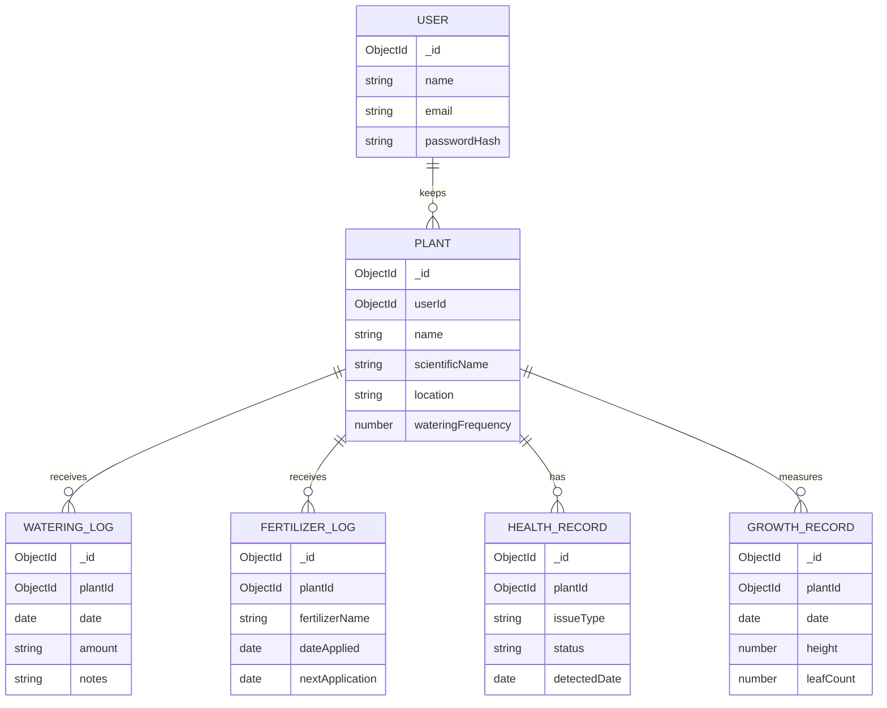

# PlantCare

A botanical journal for Indian home gardens. PlantCare records plant identity, care events, health observations and growth in MongoDB. The Streamlit interface communicates with an Express REST API; it never connects directly to MongoDB.

## Features

- Plant CRUD, search, type, environment, sunlight and care-state filters, sorting; catalogue entries include one-click removal with care-history cascade.
- Watering, fertilizer, health and growth records with timeline and date filters.
- Dashboard statistics, care reminders, recent activity and growth charts.
- Shared backend care-status calculation: `CARE OK`, `CARE SOON`, `CARE DUE`, or `OVERDUE`.
- Seed script with 12 Indian home and garden plants plus varied care histories.

## Stack and architecture

- **UI:** Python, Streamlit, Requests.
- **REST API:** Node.js, Express, Mongoose.
- **Database:** MongoDB only.



## MongoDB collections

`User` stores a name, unique normalized email and password hash. `Plant` optionally references its owner through `userId`. Each care collection has a required `plantId` ObjectId reference to `Plant`; plant deletion cascades through those records. All schemas use Mongoose timestamps. Plant references, care record plant/date fields, and user email are indexed. MongoDB's unique email index prevents duplicate accounts.

The demo has no authentication flow, so seeded plants are shared garden entries and `userId` is optional. The User model supports DBMS schema study and future account integration. Never store plaintext passwords.

## Backend API

Express mounts JSON parsing, CORS, `/api` routes, 404 handling and centralized errors. Mongoose validation and route checks return useful 400/404/409 responses.

| Method | Route | Purpose |
|---|---|---|
| GET, POST | `/api/plants` | List/search/filter or create plants |
| GET, PUT, DELETE | `/api/plants/:id` | Detail with care history, update, cascade delete |
| GET, POST, DELETE | `/api/watering` | Read, create, delete watering logs |
| GET, POST, DELETE | `/api/fertilizer` | Read, create, delete fertilizer logs |
| GET, POST, PUT, DELETE | `/api/health` | Read and manage health observations |
| GET, POST, DELETE | `/api/growth` | Read and manage measurements |
| GET | `/api/dashboard` | Statistics, care status, latest activity, growth snapshot |
| GET | `/api/dashboard/stats`, `/care`, `/activity` | Dashboard projections |
| GET | `/api/healthz` | Process and MongoDB readiness |

Plant listing accepts `search`, `type`, `environment`, `sunlight`, `status`, and `sort`. Care logs accept `plantId`, `from`, and `to` query filters. The care engine computes next watering from the last record and plant interval, then derives status from days until watering. The frontend does not store duplicate care state.

## Streamlit to Express communication

The Streamlit app uses Python Requests with `PLANTCARE_API_URL` (default `http://localhost:4000/api`). All persistence uses Express REST calls. Submitting the Add a plant form sends `POST /api/plants`; a successful response triggers a toast and opens the saved plant record. If the API call fails, the app shows the API error and does not display a false success notification. MongoDB credentials stay in the backend environment. Streamlit session state stores only the selected page/plant, not persistent application records. The UI uses a botanical editorial theme in `streamlit_app/styles.py`, with a coordinated forest-green sidebar, paper-toned cards, botanical type, animated activity timeline and charts. Motion is brief and respects reduced-motion preferences.

## Setup and run

Requirements: Node.js 20+, Python 3.10+, and MongoDB 6+ running locally or a MongoDB connection URI.

1. Configure the backend:

   ```sh
   cp backend/.env.example backend/.env
   # Set MONGODB_URI, PORT and CLIENT_URL in backend/.env
   npm install --prefix backend
   npm run seed --prefix backend
   ```

2. Start the API in one terminal:

   ```sh
   npm run dev:api
   ```

3. Install and start Streamlit in another terminal:

   ```sh
   python3 -m venv .venv
   source .venv/bin/activate
   pip install -r streamlit_app/requirements.txt
   streamlit run streamlit_app/app.py
   ```

Open the URL Streamlit prints (normally http://localhost:8501). The API runs at http://localhost:4000. Set `PLANTCARE_API_URL` to point at another API. Seed is repeatable and clears/recreates the demo collections; do not run it over data you need to retain.

## Viva guide

- **CRUD:** Plant and care REST routes map to Mongoose create, find, update and delete operations.
- **Relationships:** One plant has many care events. ObjectId references allow population and selective cascade deletion.
- **Indexing:** Plant/date indexes support timeline and dashboard lookups; unique user email enforces uniqueness.
- **Validation:** Required fields, enums, numeric bounds and casts are enforced by Mongoose; errors are translated centrally.
- **Derived data:** Care state is computed from source records and plant frequency, preventing stale duplicate status fields.
- **Architecture:** Streamlit is the Python presentation layer; Express is the REST service; MongoDB is the only persistent database.
